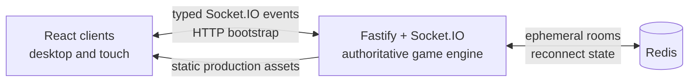

# Guess That Drawing

A guest-first, realtime multiplayer drawing and guessing game. Players create or join private rooms, build a layered avatar, choose themed word pools, take turns drawing, and score points by guessing quickly.

The browser is responsible for interaction and rendering. The Fastify and Socket.IO server is authoritative for room membership, turn phases, permissions, guesses, drawing order, and scores. Redis keeps reconnect state and short-lived rooms recoverable across server restarts.

## Requirements

- Node.js 22.12 or newer
- npm 10 or newer
- Redis 7 or newer, or Docker with Compose v2

## Local development

```bash
cp .env.example .env
```

Replace `SESSION_SECRET` in `.env` with a unique value:

```bash
openssl rand -hex 32
```

Install dependencies, start Redis, and run the web and server development processes:

```bash
npm install
docker compose up -d redis
npm run dev
```

The Vite client runs at `http://localhost:5173`; the API and Socket.IO server run at `http://localhost:3000`. The development origin in `.env.example` is already configured for that split.

To stop Redis without deleting room data:

```bash
docker compose stop redis
```

## Production container

The multi-stage image builds the shared contracts, frontend, and server, then runs only production dependencies as the unprivileged `node` user. The server serves the compiled frontend and upgrades Socket.IO connections on the same port.

Set `WEB_ORIGIN=http://localhost:3000` in `.env`, then build and start the complete stack:

```bash
docker compose --env-file .env up --build
```

Open `http://localhost:3000`. Redis is persisted in the `redis-data` volume; its optional host port binds to loopback only. Both service root filesystems are read-only, Linux capabilities are dropped, and Compose gives the Node process 30 seconds to handle `SIGTERM` and close connections cleanly.

Check service status:

```bash
docker compose ps
curl --fail http://localhost:3000/healthz
curl --fail http://localhost:3000/readyz
```

Stop the stack:

```bash
docker compose down
```

Add `--volumes` only when you intentionally want to delete persisted Redis room state.

## Validation commands

| Command | Purpose |
| --- | --- |
| `npm run typecheck` | Type-check every workspace |
| `npm test` | Run contracts, server, and web unit tests |
| `npm run test:e2e` | Run Playwright multiplayer browser tests |
| `npm run build` | Build contracts, web, and server |
| `npm run check` | Type-check, test, and build |

With the Compose Redis service running, exercise readiness and restart
rehydration against its dedicated test database:

```bash
TEST_REDIS_URL=redis://127.0.0.1:6379/15 npm run test:redis -w @gtd/server
```

The live-Redis test creates uniquely identified room and session records and
removes them when it finishes. Keep `TEST_REDIS_URL` pointed at an isolated
test database rather than a shared production Redis instance.

Playwright may require a one-time local browser installation:

```bash
npx playwright install chromium
```

## Runtime configuration

| Variable | Default | Description |
| --- | --- | --- |
| `HOST` | `0.0.0.0` | Server bind address |
| `PORT` | `3000` | Server port inside the process/container |
| `APP_PORT` | `3000` | Host port mapped by Compose |
| `WEB_ORIGIN` | `http://localhost:5173` | Exact browser origin allowed by CORS |
| `REDIS_URL` | `redis://localhost:6379` | Redis connection URL outside Compose |
| `REDIS_PORT` | `6379` | Loopback host port exposed by Compose |
| `REDIS_REQUIRED` | `true` | Fail readiness when Redis is unavailable; set `false` only for an intentional local in-memory fallback |
| `SESSION_SECRET` | none | Secret used to hash reconnect credentials; use at least 32 random characters |
| `LOG_LEVEL` | `info` | Fastify-compatible log level |
| `WEB_DIST_DIR` | `apps/web/dist` | Compiled frontend directory served by the server |

Compose supplies its own internal `REDIS_URL`, `PORT`, `HOST`, and absolute `WEB_DIST_DIR`. Never commit `.env` or deploy the placeholder session secret; production startup rejects both repository-provided placeholder values.

## Architecture



- `apps/web` contains React, routing, room state, accessibility UI, and an imperative 1600×1200 logical canvas renderer.
- `apps/server` owns phases, timers, queues, scoring, moderation, event validation, redaction, and snapshot recovery.
- `packages/contracts` contains Zod schemas, typed event maps, scoring and guess normalization, room validation, and curated themes.
- Socket actions include an idempotency ID and acknowledgement. Room revisions and drawing sequence numbers let clients reject stale data and request a complete role-redacted snapshot after reconnect.
- Rooms expire 30 minutes after becoming empty and have an eight-hour absolute lifetime. A disconnected seat is held briefly so a guest can recover using an opaque reconnect credential whose hash is stored in Redis.

## Game and data boundaries

- Guest names and layered avatar settings are persisted locally for convenience and sent only to the selected private room. Custom themes are saved in IndexedDB and uploaded only to that ephemeral room.
- Public snapshots never include the secret word or a custom theme’s unused private words. Drawer-only state is sent only to the active drawer.
- Correct and close guesses are not broadcast as chat. Close feedback is private; a correct guess produces private feedback plus a public success event.
- The drawer cannot chat during drawing, and answer-equivalent messages remain suppressed after a player has guessed.
- Chat is rendered as text, not HTML. Chat messages and answers must not be written to application logs.
- The server validates role and phase permissions, payload sizes, event rates, drawing order, and score changes. CSP and related browser security headers are set at the HTTP boundary.

## Health and shutdown

`GET /healthz` reports process liveness. `GET /readyz` verifies that the service, including its Redis dependency, is ready to accept traffic and is used by the image and Compose health checks. Readiness falls to `503` during a Redis outage and automatically recovers after Redis reconnects. During shutdown the container sends `SIGTERM`; the server stops timers and new work, closes Socket.IO and Fastify, then disconnects Redis before the 30-second grace period ends.
